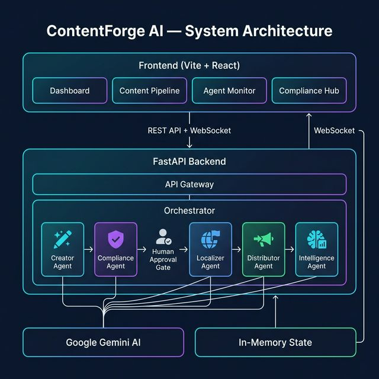

# 🚀 ContentForge AI

> **Multi-Agent Enterprise Content Operations Platform**
> Built for the **ET × Avataar Hackathon** — Problem Statement 1

[](https://python.org)
[](https://fastapi.tiangolo.com)
[](https://react.dev)
[](https://console.groq.com)

---

## 📋 Problem Statement

Enterprise content teams spend **14+ hours per piece** creating, reviewing, localizing, and distributing content across channels. Manual handoffs, inconsistent compliance, and siloed workflows cause delays, errors, and missed opportunities.

**ContentForge AI** automates the entire content lifecycle using **5 specialized AI agents** orchestrated in a sequential pipeline with **human-in-the-loop compliance gates**, reducing cycle time from hours to seconds.

---

## 🏗️ System Architecture



### Agent Pipeline Flow

```
Content Brief ──→ 🖊️ Creator ──→ ✅ Compliance ──→ 🔒 Human Gate ──→ 🌍 Localizer ──→ 📡 Distributor ──→ 📊 Intelligence
                     │                  │                  │                  │                   │                   │
                     ▼                  ▼                  ▼                  ▼                   ▼                   ▼
                Draft Content    Review Report     Approve/Reject     Translations        Channel Posts       Analytics
```

| Agent | Role | Powered By |
|-------|------|------------|
| **🖊️ Creator** | Generates content from brand briefs | Groq (LLaMA 3.3 70B) |
| **✅ Compliance** | Reviews for brand tone, legal, regulatory issues | Groq (LLaMA 3.3 70B) |
| **🔒 Human Gate** | Approval/rejection gate for flagged content | Human-in-the-Loop |
| **🌍 Localizer** | Translates + culturally adapts content | Groq (LLaMA 3.3 70B) |
| **📡 Distributor** | Formats and publishes to target channels | Groq (LLaMA 3.3 70B) |
| **📊 Intelligence** | Generates performance predictions + analytics | Groq (LLaMA 3.3 70B) |

---

## ✨ Key Features

- **🤖 5 Specialized AI Agents** — Each agent handles a distinct stage of the content lifecycle
- **🔄 Orchestrated Pipeline** — Sequential execution with automatic stage progression
- **🔒 Human-in-the-Loop** — Compliance approval gate prevents low-quality content from publishing
- **⚡ Real-time WebSocket** — Live event streaming for pipeline progress and agent status
- **🌍 Multi-language Localization** — Supports Hindi, Spanish, and more with cultural adaptation
- **📡 Multi-channel Distribution** — Website, LinkedIn, Twitter, Email, Instagram, Internal
- **📊 Analytics Dashboard** — KPI cards, time-series charts, cycle-time comparisons
- **⏱️ Measurable Time Savings** — Tracks AI seconds vs estimated manual hours

---

## 🛠️ Tech Stack

| Layer | Technology |
|-------|-----------|
| **Frontend** | React 18, Vite 5, Recharts, Lucide Icons, Framer Motion |
| **Backend** | Python 3.11+, FastAPI, Pydantic v2, Uvicorn |
| **AI Engine** | Groq API (LLaMA 3.3 70B Versatile) |
| **Real-time** | WebSocket (native FastAPI + browser) |
| **Styling** | Custom CSS (glassmorphism dark theme) |

---

## 📁 Project Structure

```
ContentForge-AI/
├── backend/
│   ├── agents/
│   │   ├── base.py              # Base agent class (timing, events, error handling)
│   │   ├── orchestrator.py      # Pipeline orchestrator (chains agents, approval gates)
│   │   ├── creator.py           # Content Creator agent
│   │   ├── compliance.py        # Compliance Reviewer agent
│   │   ├── localizer.py         # Localizer agent
│   │   ├── distributor.py       # Distributor agent
│   │   └── intelligence.py      # Intelligence Analyst agent
│   ├── main.py                  # FastAPI app (REST + WebSocket endpoints)
│   ├── models.py                # Pydantic models (Pipeline, Agents, Events)
│   ├── ai_client.py             # Groq API client
│   ├── requirements.txt         # Python dependencies
│   └── .env.example             # Environment variable template
├── frontend/
│   ├── src/
│   │   ├── App.jsx              # Router + layout
│   │   ├── api.js               # API client + WebSocket helpers
│   │   ├── index.css            # Global styles (glassmorphic dark theme)
│   │   ├── main.jsx             # React entry point
│   │   ├── components/
│   │   │   └── Sidebar.jsx      # Navigation sidebar
│   │   └── pages/
│   │       ├── Dashboard.jsx    # Analytics dashboard with KPI cards
│   │       ├── Pipeline.jsx     # Content brief form + pipeline tracker
│   │       ├── AgentMonitor.jsx # Live agent status monitor
│   │       └── ComplianceHub.jsx# Human approval queue
│   ├── index.html
│   ├── package.json
│   └── vite.config.js
├── architecture.png             # System architecture diagram
└── README.md
```

---

## 🚀 Getting Started

### Prerequisites

- **Python 3.11+**
- **Node.js 18+** and npm
- **Groq API key** ([Get one free here](https://console.groq.com/keys))

### 1. Clone the Repository

```bash
git clone https://github.com/<your-username>/ContentForge-AI.git
cd ContentForge-AI
```

### 2. Backend Setup

```bash
cd backend

# Install dependencies
pip install -r requirements.txt

# Configure environment
cp .env.example .env
# Edit .env and add your Groq API key:
# GROQ_API_KEY=your_actual_key_here

# Start the server
python -m uvicorn main:app --port 8000 --reload
```

### 3. Frontend Setup

```bash
cd frontend

# Install dependencies
npm install

# Start the dev server
npm run dev
```

### 4. Open the App

Navigate to **http://localhost:5173** in your browser.

---

## 📡 API Endpoints

| Method | Endpoint | Description |
|--------|----------|-------------|
| `GET` | `/api/health` | Health check |
| `POST` | `/api/pipeline/start` | Start a new content pipeline |
| `GET` | `/api/pipeline/{id}` | Get pipeline status & results |
| `GET` | `/api/pipelines` | List all pipelines |
| `POST` | `/api/pipeline/{id}/approve` | Approve/reject compliance gate |
| `GET` | `/api/analytics` | Aggregated analytics overview |
| `WS` | `/ws/pipeline/{id}` | Real-time pipeline events |
| `WS` | `/ws/global` | Global event stream |

### Example: Start a Pipeline

```bash
curl -X POST http://localhost:8000/api/pipeline/start \
  -H "Content-Type: application/json" \
  -d '{
    "topic": "AI in Healthcare",
    "audience": "healthcare executives",
    "format": "blog_post",
    "tone": "professional",
    "target_languages": ["Hindi", "Spanish"],
    "target_channels": ["website", "linkedin", "email"]
  }'
```

---

## 🎯 Hackathon Evaluation Criteria

| Criteria | How Addressed |
|----------|---------------|
| **Full workflow automation** | 5-agent pipeline: Create → Review → Localize → Distribute → Analyze |
| **Multi-agent coordination** | Orchestrator chains agents with WebSocket event streaming |
| **Measurable cycle time reduction** | Timing metrics on every pipeline (AI seconds vs manual hours) |
| **Compliance guardrails** | Compliance agent + human-in-the-loop approval gate |
| **Human-in-the-loop** | Approve/Reject gates in Compliance Hub |
| **Knowledge-to-content** | Knowledge Context field feeds internal data into content generation |

---

## 📸 Screenshots

### Dashboard
Analytics overview with KPI cards, time-series comparison charts, and recent pipeline feed.

### Content Pipeline
Create content briefs with topic, audience, format, tone, target languages, and channels. Real-time pipeline tracker shows progress through all 5 agent stages.

### Agent Monitor
Live monitoring of all 5 agents with coordination flow diagram and real-time event stream.

### Compliance Hub
Human-in-the-loop approval queue with approve/reject actions and compliance findings.

---

## 📄 License

This project was built for the **ET × Avataar Hackathon 2026**.

---

<p align="center">
  Built with ❤️ using <strong>Groq AI (LLaMA 3.3)</strong>, <strong>FastAPI</strong>, and <strong>React</strong>
</p>
